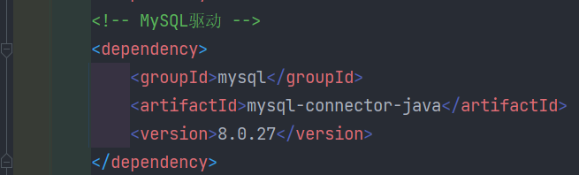
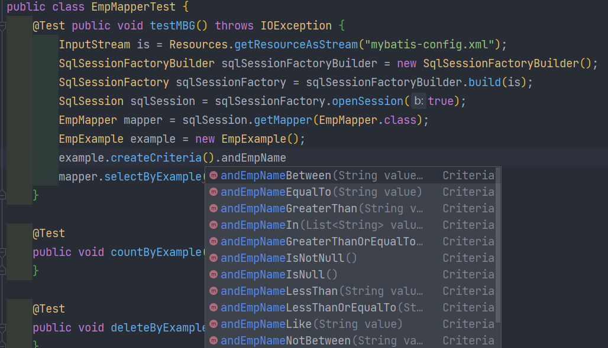

# 1. MyBatis的逆向工程
- 正向工程：先创建Java实体类，由框架负责根据实体类生成数据库表。Hibernate是支持正向工程的
- 逆向工程：先创建数据库表，由框架负责根据数据库表，反向生成如下资源：  
	- Java实体类  
	- Mapper接口  
	- Mapper映射文件
## 1.1 创建逆向工程的步骤
### 添加依赖和插件
```xml
<dependencies>
	<!-- MyBatis核心依赖包 -->
	<dependency>
		<groupId>org.mybatis</groupId>
		<artifactId>mybatis</artifactId>
		<version>3.5.9</version>
	</dependency>
	<!-- junit测试 -->
	<dependency>
		<groupId>junit</groupId>
		<artifactId>junit</artifactId>
		<version>4.13.2</version>
		<scope>test</scope>
	</dependency>
	<!-- MySQL驱动 -->
	<dependency>
		<groupId>mysql</groupId>
		<artifactId>mysql-connector-java</artifactId>
		<version>8.0.27</version>
	</dependency>
	<!-- log4j日志 -->
	<dependency>
		<groupId>log4j</groupId>
		<artifactId>log4j</artifactId>
		<version>1.2.17</version>
	</dependency>
</dependencies>
<!-- 控制Maven在构建过程中相关配置 -->
<build>
	<!-- 构建过程中用到的插件 -->
	<plugins>
		<!-- 具体插件，逆向工程的操作是以构建过程中插件形式出现的 -->
		<plugin>
			<groupId>org.mybatis.generator</groupId>
			<artifactId>mybatis-generator-maven-plugin</artifactId>
			<version>1.3.0</version>
			<!-- 插件的依赖 -->
			<dependencies>
				<!-- 逆向工程的核心依赖 -->
				<dependency>
					<groupId>org.mybatis.generator</groupId>
					<artifactId>mybatis-generator-core</artifactId>
					<version>1.3.2</version>
				</dependency>
				<!-- 数据库连接池 -->
				<dependency>
					<groupId>com.mchange</groupId>
					<artifactId>c3p0</artifactId>
					<version>0.9.2</version>
				</dependency>
				<!-- MySQL驱动 -->
				<dependency>
					<groupId>mysql</groupId>
					<artifactId>mysql-connector-java</artifactId>
					<version>8.0.27</version>
				</dependency>
			</dependencies>
		</plugin>
	</plugins>
</build>
```
### 创建MyBatis的核心配置文件
```xml
<?xml version="1.0" encoding="UTF-8" ?>
<!DOCTYPE configuration
        PUBLIC "-//mybatis.org//DTD Config 3.0//EN"
        "http://mybatis.org/dtd/mybatis-3-config.dtd">
<configuration>
    <properties resource="jdbc.properties"/>
    <typeAliases>
        <package name=""/>
    </typeAliases>
    <environments default="development">
        <environment id="development">
            <transactionManager type="JDBC"/>
            <dataSource type="POOLED">
                <property name="driver" value="${jdbc.driver}"/>
                <property name="url" value="${jdbc.url}"/>
                <property name="username" value="${jdbc.username}"/>
                <property name="password" value="${jdbc.password}"/>
            </dataSource>
        </environment>
    </environments>
    <mappers>
        <package name=""/>
    </mappers>
</configuration>
```
### 创建逆向工程的配置文件
- 文件名必须是：`generatorConfig.xml`
```xml
<?xml version="1.0" encoding="UTF-8"?>
<!DOCTYPE generatorConfiguration
        PUBLIC "-//mybatis.org//DTD MyBatis Generator Configuration 1.0//EN"
        "http://mybatis.org/dtd/mybatis-generator-config_1_0.dtd">
<generatorConfiguration>
    <!--
    targetRuntime: 执行生成的逆向工程的版本
    MyBatis3Simple: 生成基本的CRUD（清新简洁版）
    MyBatis3: 生成带条件的CRUD（奢华尊享版）
    -->
    <context id="DB2Tables" targetRuntime="MyBatis3Simple">
        <!-- 数据库的连接信息 -->
        <jdbcConnection driverClass="com.mysql.cj.jdbc.Driver"
                        connectionURL="jdbc:mysql://localhost:3306/mybatis"
                        userId="root"
                        password="123456">
        </jdbcConnection>
        <!-- javaBean的生成策略-->
        <javaModelGenerator targetPackage="com.atguigu.mybatis.pojo" targetProject=".\src\main\java">
            <property name="enableSubPackages" value="true" />
            <property name="trimStrings" value="true" />
        </javaModelGenerator>
        <!-- SQL映射文件的生成策略 -->
        <sqlMapGenerator targetPackage="com.atguigu.mybatis.mapper"
                         targetProject=".\src\main\resources">
            <property name="enableSubPackages" value="true" />
        </sqlMapGenerator>
        <!-- Mapper接口的生成策略 -->
        <javaClientGenerator type="XMLMAPPER"
                             targetPackage="com.atguigu.mybatis.mapper" targetProject=".\src\main\java">
            <property name="enableSubPackages" value="true" />
        </javaClientGenerator>
        <!-- 逆向分析的表 -->
        <!-- tableName设置为*号，可以对应所有表，此时不写domainObjectName -->
        <!-- domainObjectName属性指定生成出来的实体类的类名 -->
        <table tableName="t_emp" domainObjectName="Emp"/>
        <table tableName="t_dept" domainObjectName="Dept"/>
    </context>
</generatorConfiguration>
```
### 执行MBG插件的generate目标
 
- 如果出现报错：`Exception getting JDBC Driver`，可能是pom.xml中，数据库驱动配置错误
	- dependency中的驱动
	- mybatis-generator-maven-plugin插件中的驱动
	- 两者的驱动版本应该相同
- 执行结果
- 
# 2. QBC
## 2.1 查询
- `selectByExample`：按条件查询，需要传入一个example对象或者null；如果传入一个null，则表示没有条件，也就是查询所有数据
- `example.createCriteria().xxx`：创建条件对象，通过andXXX方法为SQL添加查询添加，每个条件之间是and关系
- `example.or().xxx`：将之前添加的条件通过or拼接其他条件

```java
@Test public void testMBG() throws IOException {
	InputStream is = Resources.getResourceAsStream("mybatis-config.xml");
	SqlSessionFactoryBuilder sqlSessionFactoryBuilder = new SqlSessionFactoryBuilder();
	SqlSessionFactory sqlSessionFactory = sqlSessionFactoryBuilder.build(is);
	SqlSession sqlSession = sqlSessionFactory.openSession(true);
	EmpMapper mapper = sqlSession.getMapper(EmpMapper.class);
	EmpExample example = new EmpExample();
	//名字为张三，且年龄大于等于20
	example.createCriteria().andEmpNameEqualTo("张三").andAgeGreaterThanOrEqualTo(20);
	//或者did不为空
	example.or().andDidIsNotNull();
	List<Emp> emps = mapper.selectByExample(example);
	emps.forEach(System.out::println);
}
```

## 2.2 增改
- `updateByPrimaryKey`：通过主键进行数据修改，如果某一个值为null，也会将对应的字段改为null
	- `mapper.updateByPrimaryKey(new Emp(1,"admin",22,null,"456@qq.com",3));`
	- 
- `updateByPrimaryKeySelective()`：通过主键进行选择性数据修改，如果某个值为null，则不修改这个字段
	- `mapper.updateByPrimaryKeySelective(new Emp(2,"admin2",22,null,"456@qq.com",3));`
	- 
# 3. 分页插件
## 3.1 分页插件使用步骤
### 添加依赖
```xml
<!-- https://mvnrepository.com/artifact/com.github.pagehelper/pagehelper -->
<dependency>
	<groupId>com.github.pagehelper</groupId>
	<artifactId>pagehelper</artifactId>
	<version>5.2.0</version>
</dependency>
```
### 配置分页插件
- 在MyBatis的核心配置文件（mybatis-config.xml）中配置插件
- 
```xml
<plugins>
	<!--设置分页插件-->
	<plugin interceptor="com.github.pagehelper.PageInterceptor"></plugin>
</plugins>
```
## 3.2 分页插件的使用
### 开启分页功能
- 在查询功能之前使用`PageHelper.startPage(int pageNum, int pageSize)`开启分页功能
	- pageNum：当前页的页码  
	- pageSize：每页显示的条数
```java
@Test
public void testPageHelper() throws IOException {
	InputStream is = Resources.getResourceAsStream("mybatis-config.xml");
	SqlSessionFactoryBuilder sqlSessionFactoryBuilder = new SqlSessionFactoryBuilder();
	SqlSessionFactory sqlSessionFactory = sqlSessionFactoryBuilder.build(is);
	SqlSession sqlSession = sqlSessionFactory.openSession(true);
	EmpMapper mapper = sqlSession.getMapper(EmpMapper.class);
	//访问第一页，每页四条数据
	PageHelper.startPage(1,4);
	List<Emp> emps = mapper.selectByExample(null);
	emps.forEach(System.out::println);
}
```


### 分页相关数据
#### 方法一：直接输出
```java
@Test
public void testPageHelper() throws IOException {
	InputStream is = Resources.getResourceAsStream("mybatis-config.xml");
	SqlSessionFactoryBuilder sqlSessionFactoryBuilder = new SqlSessionFactoryBuilder();
	SqlSessionFactory sqlSessionFactory = sqlSessionFactoryBuilder.build(is);
	SqlSession sqlSession = sqlSessionFactory.openSession(true);
	EmpMapper mapper = sqlSession.getMapper(EmpMapper.class);
	//访问第一页，每页四条数据
	Page<Object> page = PageHelper.startPage(1, 4);
	List<Emp> emps = mapper.selectByExample(null);
	//在查询到List集合后，打印分页数据
	System.out.println(page);
}
```
- 分页相关数据：
	```
	Page{count=true, pageNum=1, pageSize=4, startRow=0, endRow=4, total=8, pages=2, reasonable=false, pageSizeZero=false}[Emp{eid=1, empName='admin', age=22, sex='男', email='456@qq.com', did=3}, Emp{eid=2, empName='admin2', age=22, sex='男', email='456@qq.com', did=3}, Emp{eid=3, empName='王五', age=12, sex='女', email='123@qq.com', did=3}, Emp{eid=4, empName='赵六', age=32, sex='男', email='123@qq.com', did=1}]
	```
#### 方法二使用PageInfo
- 在查询获取list集合之后，使用`PageInfo<T> pageInfo = new PageInfo<>(List<T> list, intnavigatePages)`获取分页相关数据
	- list：分页之后的数据  
	- navigatePages：导航分页的页码数
```java
@Test
public void testPageHelper() throws IOException {
	InputStream is = Resources.getResourceAsStream("mybatis-config.xml");
	SqlSessionFactoryBuilder sqlSessionFactoryBuilder = new SqlSessionFactoryBuilder();
	SqlSessionFactory sqlSessionFactory = sqlSessionFactoryBuilder.build(is);
	SqlSession sqlSession = sqlSessionFactory.openSession(true);
	EmpMapper mapper = sqlSession.getMapper(EmpMapper.class);
	PageHelper.startPage(1, 4);
	List<Emp> emps = mapper.selectByExample(null);
	PageInfo<Emp> page = new PageInfo<>(emps,5);
	System.out.println(page);
}
```
- 分页相关数据：
	```
	PageInfo{
	pageNum=1, pageSize=4, size=4, startRow=1, endRow=4, total=8, pages=2, 
	list=Page{count=true, pageNum=1, pageSize=4, startRow=0, endRow=4, total=8, pages=2, reasonable=false, pageSizeZero=false}[Emp{eid=1, empName='admin', age=22, sex='男', email='456@qq.com', did=3}, Emp{eid=2, empName='admin2', age=22, sex='男', email='456@qq.com', did=3}, Emp{eid=3, empName='王五', age=12, sex='女', email='123@qq.com', did=3}, Emp{eid=4, empName='赵六', age=32, sex='男', email='123@qq.com', did=1}], 
	prePage=0, nextPage=2, isFirstPage=true, isLastPage=false, hasPreviousPage=false, hasNextPage=true, navigatePages=5, navigateFirstPage=1, navigateLastPage=2, navigatepageNums=[1, 2]}
	```
- 其中list中的数据等同于方法一中直接输出的page数据
#### 常用数据：
- pageNum：当前页的页码  
- pageSize：每页显示的条数  
- size：当前页显示的真实条数  
- total：总记录数  
- pages：总页数  
- prePage：上一页的页码  
- nextPage：下一页的页码
- isFirstPage/isLastPage：是否为第一页/最后一页  
- hasPreviousPage/hasNextPage：是否存在上一页/下一页  
- navigatePages：导航分页的页码数  
- navigatepageNums：导航分页的页码，\[1,2,3,4,5]