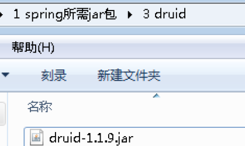

# IOC

### IOC（概念和原理）

1. 什么是IOC
    - 控制反转，把对象创建和对象之间的调用过程，交给Spring进行管理
2. 使用IOC目的
    - 耦合度降低
3. IOC底层原理
    - xml解析、工厂模式、反射

### IOC（BeanFactory接口）

1. IOC思想基于IOC容器完成，IOC容器底层就是对象工厂
2. Spring提供IOC容器实现两种方式（两个接口）
    1. BeanFactory：IOC容器基本实现，是Spring内部的使用接口，不提供开发人员进行使用，加载配置文件时候不会创建对象，在获取对象（使用）才去创建对象
    2. ApplicationContext：BeanFactory接口的子接口，提供更多更强大的功能，一般由开发人员进行使用，加载配置文件时候就会把在配置文件对象进行创建
    3. ApplicationContext接口的实现类
        - FileSystemXmlApplicationContext
        - ClassPathXmlApplicationContext
        
        <aside>
        💡 FileSystemXmlApplicationContext通过盘符路径加载Xml配置文件
        
        </aside>
        

### IOC操作Bean管理（概念）

1. 什么是Bean管理
    - Bean管理指的是两个操作
        - Spring创建对象
        - Spirng注入属性
2. Bean管理操作有两种方式
    - 基于xml配置文件方式实现
    - 基于注解方式实现

### IOC操作Bean管理——基于Xml方式

1. 基于xml方式创建对象
    1. 在spring配置文件中，使用bean标签，标签里面添加对应属性，就可以实现对象创建
        
        ```java
        <!--配置User对象创建--> 
        <bean id="user" class="com.tyd.spring5.User"></bean>
        ```
        
    2. 创建对象时候，默认也是执行无参数构造方法完成对象创建
2. 基于xml方式注入属性（基本属性）
    
    <aside>
    💡 DI：依赖注入，就是注入属性
    
    </aside>
    
    - 第一种注入方式：使用set方法进行注入
        - 创建类，定义属性和对应的set方法
            
            ```java
            public class Book {
                //创建属性
                private String bname;
                private String bauthor;
                //创建属性对应的set方法
                public void setBname(String bname) {
                    this.bname = bname;
                }
                public void setBauthor(String bauthor) {
                    this.bauthor = bauthor;
                }
            }
            ```
            
        - 在spring配置文件配置对象创建，配置属性注入
            
            ```xml
            <bean id="book" class="com.tyd.spring5.Book">
                    <!--使用property完成属性注入
                        name：类里面属性名称
                        value：向属性注入的值
                    -->
                    <property name="bname" value="西游记"></property>
                    <property name="bauthor" value="吴承恩"></property>
                </bean>
            ```
            
    - 第二种注入方式：使用有参数构造进行注入
        - 创建类，定义属性，创建属性对应有参数构造方法
            
            ```java
            public class Orders {
                //属性
                private String oname;
                private String address;
                //有参数构造
                public Orders(String oname, String address) {
                    this.oname = oname;
                    this.address = address;
                }
            }
            ```
            
        - 在spring配置文件中进行配置
            
            ```xml
            <!--3 有参数构造注入属性-->
                <bean id="orders" class="com.tyd.spring5.Orders">
                    <constructor-arg name="oname" value="电脑"></constructor-arg>
                    <constructor-arg name="address" value="China"></constructor-arg>
                </bean>
            ```
            
    - p名称空间注入（简化Set注入方法）
        - 添加p名称空间在配置文件中
            
            ```xml
            <beans xmlns="http://www.springframework.org/schema/beans"
                   xmlns:xsi="http://www.w3.org/2001/XMLSchema-instance"
                   xmlns:p="http://www.springframework.org/schema/p">
            ```
            
        - 进行属性注入，在bean标签里面进行操作
            
            ```xml
            <!--2 set方法注入属性--> 
            <bean id="book" class="com.atguigu.spring5.Book" p:bname="九阳神功" p:bauthor="无名氏"></bean>
            ```
            
3. 基于Xml 注入属性（其他类型）
    - 字面量
        - null值
            
            ```xml
            <!--null值，初始化address的值为null--> 
            <property name="address"> <null/> </property>
            ```
            
        - 属性值包含特殊符号
            
            ```xml
            <!--属性值包含特殊符号 
            	1 把<>进行转义 &lt; &gt; 
            	2 把带特殊符号内容写到CDATA 
            --> 
            <property name="address"> 
            	<value><![CDATA[<<南京>>]]></value> 
            </property>
            <!--address的值为<<南京>>-->
            ```
            
    - 外部bean
        - 定义一个Dao接口实现类
            
            ```java
            public class UserDaoImpl implements UserDao {
                @Override
                public void update() {
                    System.out.println("外部bean");
                }
            }
            ```
            
        - 定义一个Service类
            
            ```java
            public class UserService {
                private UserDao userDao;
            
                public void setUserDao(UserDao userDao) {
                    this.userDao = userDao;
                }
            }
            ```
            
        - 配置Spring的Xml文件
            
            ```xml
            <bean id="userService" class="com.atguigu.spring5.service.UserService"> 
            <!--注入userDao对象 
            	name属性：类里面属性名称 
            	ref属性：创建userDao对象bean标签id值 
            --> 
            	<property name="userDao" ref="userDaoImpl"></property> 
            </bean> 
            
            <bean id="userDaoImpl" class="com.atguigu.spring5.dao.UserDaoImpl"></bean>
            ```
            
    - 内部bean
        - 在实体类之间表示一对多关系（一个部门有多个员工，一个员工属于一个部门）
        - 创建部门类和员工类
            
            ```java
            //部门类 
            public class Dept { 
            	private String dname; 
            	public void setDname(String dname) { 
            		this.dname = dname; 
            	} 
            } 
            //员工类 
            public class Emp { 
            	private String ename; 
            	private String gender; 
            	//员工属于某一个部门，使用对象形式表示 
            	private Dept dept; 
            	public void setDept(Dept dept) { 
            		this.dept = dept; 
            	} 
            	public void setEname(String ename) { 
            		this.ename = ename; 
            	} 
            	public void setGender(String gender) { 
            		this.gender = gender;
            	}
            }
            ```
            
        - 配置Xml文件
            
            ```xml
            <!--内部bean--> 
            <bean id="emp" class="com.atguigu.spring5.bean.Emp"> 
            	<!--设置两个普通属性--> 
            	<property name="ename" value="lucy"></property> 
            	<property name="gender" value="女"></property> 
            	<!--设置对象类型属性--> 
            	<property name="dept"> 
            		<bean id="dept" class="com.atguigu.spring5.bean.Dept"> 
            			<property name="dname" value="安保部"></property> 
            		</bean> 
            	</property> 
            </bean>
            ```
            
4. 基于Xml注入属性（集合属性）
    - 注入数组、List、Map、Set等集合属性
        - 创建类，定义数组、list、map、set类型属性，生成对应set方法
            
            ```java
            public class Stu {
                //1 数组类型属性
                private String[] courses;
                //2 list集合类型属性
                private List<String> list;
                //3 map集合类型属性
                private Map<String,String> maps;
                //4 set集合类型属性
                private Set<String> sets;
                
                public void setSets(Set<String> sets) {
                    this.sets = sets;
                }
                public void setCourses(String[] courses) {
                    this.courses = courses;
                }
                public void setList(List<String> list) {
                    this.list = list;
                }
                public void setMaps(Map<String, String> maps) {
                    this.maps = maps;
                }
            ```
            
        - 在spring配置文件进行配置
            
            ```xml
            <!--（2）在 spring 配置文件进行配置-->
                <bean id="stu" class="com.atguigu.spring5.collectiontype.Stu">
                    <!--数组类型属性注入-->
                    <property name="courses">
                        <array>
                            <value>java课程</value>
                            <value>数据库课程</value>
                        </array>
                    </property>
                    <!--list类型属性注入-->
                    <property name="list">
                        <list>
                            <value>张三</value>
                            <value>小三</value>
                        </list>
                    </property>
                    <!--map类型属性注入-->
                    <property name="maps">
                        <map>
                            <entry key="JAVA" value="java"></entry>
                            <entry key="PHP" value="php"></entry>
                        </map>
                    </property>
                    <!--set类型属性注入-->
                    <property name="sets">
                        <set>
                            <value>MySQL</value>
                            <value>Redis</value>
                        </set>
                    </property>
            </bean>
            ```
            
    - 在集合中设置对象类型值
        - 创建一个Course类，在学生类Stu中添加如下属性成员
            
            ```java
            //学生所学多门课程
                private List<Course> courseList;//创建集合
                public void setCourseList(List<Course> courseList) {
                    this.courseList = courseList;
                }
            ```
            
        - 配置Xml文件
            
            ```xml
            <!--创建多个course对象-->
                <bean id="course1" class="com.atguigu.spring5.collectiontype.Course">
                    <property name="cname" value="Spring5框架"></property>
                </bean>
                <bean id="course2" class="com.atguigu.spring5.collectiontype.Course">
                    <property name="cname" value="MyBatis框架"></property>
                </bean>
                
               	<!--在Stu类中注入list集合类型，值是对象-->
            		<bean id="stu" class="com.atguigu.spring5.collectiontype.Stu">
                   <property name="courseList">
                       <list>
                           <ref bean="course1"></ref>
                           <ref bean="course2"></ref>
                       </list>
                   </property>
            		</bean>
            ```
            
    - 把集合注入部分提取出来
        - 在spring配置文件中引入名称空间 util
            
            ```xml
            <?xml version="1.0" encoding="UTF-8"?>
            <beans xmlns="http://www.springframework.org/schema/beans"
                   xmlns:xsi="http://www.w3.org/2001/XMLSchema-instance"
                   xmlns:util="http://www.springframework.org/schema/util" <!--添加util名称空间-->
                   xsi:schemaLocation="http://www.springframework.org/schema/beans http://www.springframework.org/schema/beans/spring-beans.xsd
                                       http://www.springframework.org/schema/util http://www.springframework.org/schema/util/spring-util.xsd"> 
            ```
            
        - 使用util标签完成list集合注入提取
            
            ```xml
            <!--把集合注入部分提取出来-->
             <!--1 提取list集合类型属性注入-->
                <util:list id="bookList">
                    <value>易筋经</value>
                    <value>九阴真经</value>
                    <value>九阳神功</value>
                </util:list>
            
             <!--2 提取list集合类型属性注入使用-->
                <bean id="book" class="com.atguigu.spring5.collectiontype.Book" scope="prototype">
                    <property name="list" ref="bookList"></property>
                </bean>
            ```
            
5. FactoryBean
    - Spring有两种类型bean，一种普通bean，另外一种工厂bean（FactoryBean）
        - 普通bean：在配置文件中定义bean时为A类型，则返回的对象也是A类型
        - 工厂bean：在配置文件中定义bean时为A类型，返回的对象可以是其他类型
    - FactoryBean实现返回对象为其他类型
        - 创建类，让这个类作为工厂bean，实现接口 FactoryBean
            
            ```java
            public class MyBean implements FactoryBean<Course> {
            
                //定义返回bean
                @Override
                public Course getObject() throws Exception {
                    Course course = new Course();
                    course.setCname("abc");
                    return course;
                }
            }
            ```
            
        - 配置Xml文件
            
            ```xml
            <bean id="myBean" class="com.atguigu.spring5.factorybean.MyBean">
            </bean>
            ```
            
        - 测试
            
            ```java
            @Test
            public void test3() {
             ApplicationContext context =
             new ClassPathXmlApplicationContext("bean3.xml");
             Course course = context.getBean("myBean", Course.class);//返回值类型可以不是定义的bean类型！
             System.out.println(course);
            }
            ```
            
6. Bean作用域
    - 在Spring里面，设置创建bean实例是单实例还是多实例
    - 在Spring里面，默认情况下，bean是单实例对象
    - 设置bean为多实例对象
        - 在spring配置文件bean标签里面有属性（scope）用于设置单实例还是多实例
        - scope属性值
            - 默认值，singleton，表示是单实例对象
            - prototype，表示是多实例对象
                
                ```xml
                <bean id="book" class="com.atguigu.spring5.collectiontype.Book" scope="prototype"><!--设置为多实例-->
                        <property name="list" ref="bookList"></property>
                </bean>
                ```
                
                测试
                
                ```java
                Book book1=context.getBean("book",Book.class);
                Book book2=context.getBean("book",Book.class);
                System.out.println(book1);
                System.out.println(book2);
                //输出的两个对象指针不一样，说明指向两个不同对象
                ```
                
            
            <aside>
            💡 singleton和prototype区别：除了singleton创建单实例，prototype创建多实例，另外，设置scope值是singleton时候，加载spring配置文件时候就会创建单实例对象；设置scope值是prototype时候，不是在加载spring配置文件时候创建 对象，在调用getBean方法时候创建多实例对象
            
            </aside>
            
7. bean生命周期
    - 正常生命周期为五步，而配置后置处理器后为七步
        - 通过构造器创建 bean 实例（无参数构造）
        - 为 bean 的属性设置值和对其他 bean 引用（调用 set 方法）
        - 把 bean 实例传递 bean 后置处理器的方法 postProcessBeforeInitialization
        - 调用 bean 的初始化的方法（需要进行配置初始化的方法）
        - 把 bean 实例传递 bean 后置处理器的方法 postProcessAfterInitialization
        - bean 可以使用了（对象获取到了）
        - 当容器关闭时候，调用 bean 的销毁的方法（需要进行配置销毁的方法）
    - 代码演示
        
        ```xml
        <!--配置文件的bean参数配置-->
        <bean id="orders" class="com.atguigu.spring5.bean.Orders" init-method="initMethod" destroy-method="destroyMethod">	<!--配置初始化方法和销毁方法-->
            <property name="oname" value="手机"></property><!--这里就是通过set方式（注入属性）赋值-->
        </bean>
        
        <!--配置后置处理器-->
        <bean id="myBeanPost" class="com.atguigu.spring5.bean.MyBeanPost"></bean>
        ```
        
        ```java
        public class Orders {
             //无参数构造
             public Orders() {
             System.out.println("第一步 执行无参数构造创建 bean 实例");
             }
             private String oname;
             public void setOname(String oname) {
             this.oname = oname;
             System.out.println("第二步 调用 set 方法设置属性值");
             }
             //创建执行的初始化的方法
             public void initMethod() {
             System.out.println("第三步 执行初始化的方法");
             }
             //创建执行的销毁的方法
             public void destroyMethod() {
             System.out.println("第五步 执行销毁的方法");
             }
        }
        ```
        
        ```java
        public class MyBeanPost implements BeanPostProcessor {//创建后置处理器实现类
            @Override
            public Object postProcessBeforeInitialization(Object bean, String beanName) throws BeansException {
                System.out.println("在初始化之前执行的方法");
                return bean;
            }
            @Override
            public Object postProcessAfterInitialization(Object bean, String beanName) throws BeansException {
                System.out.println("在初始化之后执行的方法");
                return bean;
            }
        }
        ```
        
        ```java
        @Test
         public void testBean3() {
        // ApplicationContext context =
        // new ClassPathXmlApplicationContext("bean4.xml");
         ClassPathXmlApplicationContext context =new ClassPathXmlApplicationContext("bean4.xml");
         Orders orders = context.getBean("orders", Orders.class);
         System.out.println("第四步 获取创建 bean 实例对象");
         System.out.println(orders);
         //手动让 bean 实例销毁
         context.close();
         }
        ```
        
8. bean自动装配
    - bean标签属性autowire，配置自动装配
    - autowire属性常用两个值：
        - byName根据属性名称注入 ，注入值bean的id值和类属性名称一样
        - byType根据属性类型注入
    - byName
        
        ```xml
        <bean id="emp" class="com.atguigu.spring5.autowire.Emp" autowire="byName">
         <!--<property name="dept" ref="dept"></property>-->
        </bean> 
        <bean id="dept" class="com.atguigu.spring5.autowire.Dept"></bean>
        ```
        
    - byType
        
        ```xml
        <bean id="emp" class="com.atguigu.spring5.autowire.Emp" autowire="byType">
         <!--<property name="dept" ref="dept"></property>-->
        </bean> 
        <bean id="dept" class="com.atguigu.spring5.autowire.Dept"></bean>
        ```
        
9. 外部属性文件（以配置jdbc作为案例）
    - 直接配置数据库信息
        - 引入德鲁伊连接池依赖jar包
            
            
            
        - 直接配置连接池
            
            ```xml
            <!--直接配置连接池-->
                <bean id="dataSource" class="com.alibaba.druid.pool.DruidDataSource">
                    <property name="driverClassName" value="com.mysql.jdbc.Driver"></property>
                    <property name="url" value="jdbc:mysql://localhost:3306/userDb"></property>
                    <property name="username" value="root"></property>
                    <property name="password" value="root"></property>
                </bean>
            ```
            
    - 使用外部属性文件
        - 创建外部属性文件，properties 格式，写数据库信息（**jdbc.properties**）
            
            ```xml
            prop.driverClass=com.mysql.jdbc.Driver
            prop.url=jdbc:mysql://localhost:3306/userDb
            prop.userName=root
            prop.password=root
            ```
            
        - 把外部 properties 属性文件引入到 spring 配置文件中 —— 引入 context 名称空间
            
            ```xml
            <beans xmlns="http://www.springframework.org/schema/beans"
                   xmlns:xsi="http://www.w3.org/2001/XMLSchema-instance"
                   xmlns:context="http://www.springframework.org/schema/context"
                   xsi:schemaLocation="http://www.springframework.org/schema/beans http://www.springframework.org/schema/beans/spring-beans.xsd
                                       http://www.springframework.org/schema/context http://www.springframework.org/schema/context/spring-context.xsd"><!--引入context名称空间-->
                
                    <!--引入外部属性文件-->
                <context:property-placeholder location="classpath:jdbc.properties"/>
            
                <!--配置连接池-->
                <bean id="dataSource" class="com.alibaba.druid.pool.DruidDataSource">
                    <property name="driverClassName" value="${prop.driverClass}"></property>
                    <property name="url" value="${prop.url}"></property>
                    <property name="username" value="${prop.userName}"></property>
                    <property name="password" value="${prop.password}"></property>
                </bean>
                
            </beans>
            ```
            

### IOC操作Bean管理（基于注解方式）

1. 什么是注解
    1. 注解是代码特殊标记。格式：@注解名称(属性名称=属性值, 属性名称=属性值..)
    2. 使用注解：注解作用在类上面，方法上面，属性上面
    3. 使用注解目的：简化xml配置
2. Spring针对Bean管理中创建对象提供注解
    1. @Component
    2. @Service
    3. @Controller
    4. @Repository
    
    <aside>
    💡 上面四个注解功能是一样的，都可以用来创建bean实例
    
    </aside>
    
3. 基于注解方式实现对象创建
    1. 引入依赖、
        
        spring-aop-5.2.6.RELEASE.jar
        
    2. 开启组件扫描
        
        ```xml
        <!--开启组件扫描
         1 如果扫描多个包，多个包使用逗号隔开
         2 扫描包上层目录
        -->
        <context:component-scan base-package="com.atguigu"></context:component-scan>
        ```
        
    3. 创建类，在类上面添加创建对象注解
        
        ```java
        //在注解里面 value 属性值可以省略不写，
        //默认值是类名称，首字母小写
        //UserService -- userService
        @Component(value = "userService") //注解等同于XML配置文件：<bean id="userService" class=".."/>
        public class UserService {
         public void add() {
         System.out.println("service add.......");
         }
        }
        ```
        
4. 开启组件扫描细节配置
    
    ```xml
    <!--示例 1
     use-default-filters="false" 表示现在不使用默认 filter，自己配置 filter
     context:include-filter ，设置扫描哪些内容
    -->
    <context:component-scan base-package="com.atguigu" use-defaultfilters="false">
    	<context:include-filter type="annotation" expression="org.springframework.stereotype.Controller"/>
    	<!--代表只扫描Controller注解的类-->
    </context:component-scan>
    
    <!--示例 2
     下面配置扫描包所有内容
     context:exclude-filter： 设置哪些内容不进行扫描
    -->
    <context:component-scan base-package="com.atguigu">
    	<context:exclude-filter type="annotation" expression="org.springframework.stereotype.Controller"/>
    	<!--表示Controller注解的类之外一切都进行扫描-->
    </context:component-scan>
    ```
    
5. 基于注解方式实现属性注入
    - @Autowired：根据属性类型进行自动装配
        - 创建userService和userDao对象：在UserService和UserDao类添加创建对象注解
        - 在userService注入userDao对象：在UserService类添加UserDao类型属性，在属性上面使用’@Autowired‘注解
        
        ```java
        @Service
        public class UserService {
         //定义 dao 类型属性
         //不需要添加 set 方法
         //添加注入属性注解
         @Autowired
         private UserDao userDao;
         public void add() {
         System.out.println("service add.......");
         userDao.add();
         }
        }
        
        //Dao实现类
        @Repository
        //@Repository(value = "userDaoImpl1")
        public class UserDaoImpl implements UserDao {
            @Override
            public void add() {
                System.out.println("dao add.....");
            }
        }
        ```
        
    - @Qualifier：根据名称进行注入
        - @Qualifier注解的使用，和上面@Autowired一起使用
        
        ```java
        //定义 dao 类型属性
        //不需要添加 set 方法
        //添加注入属性注解
        @Autowired //根据类型进行注入
        //根据名称进行注入（目的在于区别同一接口下有多个实现类，根据类型就无法选择，从而出错！）
        @Qualifier(value = "userDaoImpl1") 
        private UserDao userDao;
        ```
        
    - @Resource：可以根据类型注入，也可以根据名称注入（它属于javax包下的注解，不推荐使用！）
        
        ```java
        //@Resource //根据类型进行注入
        @Resource(name = "userDaoImpl1") //根据名称进行注入
        private UserDao userDao;
        ```
        
    - @Value：注入普通类型属性
        
        ```java
        @Value(value = "abc")
        private String name
        ```
        
6. 完全注解开发
    1. 创建配置类，替代 xml 配置文件
        
        ```java
        @Configuration //作为配置类，替代 xml 配置文件
        @ComponentScan(basePackages = {"com.atguigu"})
        public class SpringConfig {
            
        }
        ```
        
    2. 编写测试类
        
        ```java
        @Test
        public void testService2() {
         //加载配置类
         ApplicationContext context
         = new AnnotationConfigApplicationContext(SpringConfig.class);
         UserService userService = context.getBean("userService",UserService.class);
         System.out.println(userService);
         userService.add();
        }
        ```