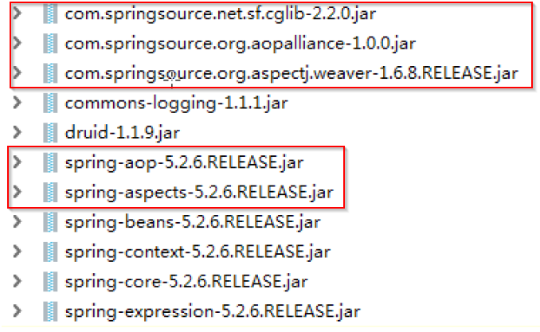

# Aop

### Aop概念

- 什么是AOP
    - 面向切面编程，利用AOP可以对业务逻辑的各个部分进行隔离，从而使得业务逻辑各部分之间的耦合度降低，提高程序的可重用性，同时提高了开发的效率
    - 通俗描述：不通过修改源代码方式，在主干功能里面添加新功能

### Aop底层原理（理解）

- AOP底层使用动态代理，分两种情况
    - 第一种 有接口情况，使用JDK动态代理
        - 具体做法：创建接口实现类代理对象，进而增强类的方法
    - 第二种 没有接口情况，使用CGLIB动态代理
        - 具体做法：创建子类的代理对象，增强类的方法
- Aop（JDK动态代理）
    - 创建接口，定义方法
        
        ```java
        public interface UserDao {
         public int add(int a,int b);
         public String update(String id);
        }
        ```
        
    - 创建接口实现类，实现方法
        
        ```java
        public class UserDaoImpl implements UserDao {
         @Override
         public int add(int a, int b) {
         return a+b;
         }
         @Override
         public String update(String id) {
         return id;
         }
        }
        ```
        
    - 使用Proxy类创建接口代理对象
        
        <aside>
        ⚠️ 在使用 JDK 动态代理，底层使用 Proxy 类里面的newProxyInstance方法创建代理对象
        
        ```java
        public static Object newProxyInstance(ClassLoader loader,Class<?>[] interfaces,InvocationHandler h)
        ```
        
        #第一参数，类加载器
        
        #第二参数，增强方法所在的类，这个类实现的接口，*支持多个接口*
        
        #第三参数，实现这个接口 InvocationHandler，创建代理对象，写增强的部分
        
        </aside>
        
        代码示例：
        
        ```java
        public class JDKProxy {
         public static void main(String[] args) {
         //创建接口实现类代理对象
         Class[] interfaces = {UserDao.class};
         UserDaoImpl userDao = new UserDaoImpl(); 
        /** 第一参数，类加载器 
        	第二参数，增强方法所在的类，这个类实现的接口，(支持多个接口)
        	第三参数，实现这个接口 InvocationHandler，创建代理对象，写增强的部分  */
         UserDao dao =(UserDao)Proxy.newProxyInstance(JDKProxy.class.getClassLoader(), interfaces,
        					new UserDaoProxy(userDao));
         int result = dao.add(1, 2);
         System.out.println("result:"+result);
         }
        }
        
        //创建代理对象代码
        class UserDaoProxy implements InvocationHandler {
         //1 把创建的是谁的代理对象，把谁传递过来
         //有参数构造传递
         private Object obj;
         public UserDaoProxy(Object obj) {
         this.obj = obj;
         }
         //增强的逻辑
         @Override
         public Object invoke(Object proxy, Method method, Object[] args) throws Throwable {
         //方法之前
         System.out.println("方法之前执行...."+method.getName()+" :传递的参数..."+ Arrays.toString(args));
         //被增强的方法执行
         Object res = method.invoke(obj, args);
         //方法之后
         System.out.println("方法之后执行...."+obj);
         return res;
         }
        }
        ```
        

### Aop术语

- 术语列表
    - 连接点：类里面哪些方法可以被增强，这些方法称为连接点
    - 切入点：实际被真正增强的方法称为切入点
    - 通知（增强）：实际增强的逻辑部分称为通知，且分为以下五种类型
        - 前置通知
        - 后置通知
        - 环绕通知
        - 异常通知
        - 最终通知
    - 切面：把通知应用到切入点过程

### Aop准备工作

- 基于AspectJ实现Aop操作
    - Spring框架一般都是基于AspectJ实现AOP操作
        - AspectJ不是Spring组成部分，独立AOP框架，一般把AspectJ和Spirng框架一起使用，进行AOP操作
    - AspectJ实现AOP操作两种方式
        - 基于xml配置文件实现
        - 基于注解方式实现（常用）
    - 引入Aop相关依赖
        
        
        
    - 切入点表达式
        - 切入点表达式作用：知道对哪个类里面的哪个方法进行增强
        - 语法结构： execution([权限修饰符] [返回类型] [类全路径][方法名称]([参数列表]))
        
        ```java
        #对com.atguigu.dao.BookDao 类里面的 add 方法进行增强
        execution(* com.atguigu.dao.BookDao.add(..))
        #对 com.atguigu.dao.BookDao 类里面的所有的方法进行增强
        execution(* com.atguigu.dao.BookDao.* (..))
        #对 com.atguigu.dao 包里面所有类，类里面所有方法进行增强
        execution(* com.atguigu.dao.*.* (..))
        ```
        

### ****AOP 操作（AspectJ 注解）****

- 创建类，在类里面定义方法
    
    ```java
    public class User {
     public void add() {
     System.out.println("add.......");
     }
    }
    ```
    
- 创建增强类（编写增强逻辑）
    - 在增强类里面，创建方法，让不同方法代表不同通知类型
        
        ```java
        //增强的类
        public class UserProxy {
         public void before() {//前置通知
         System.out.println("before......");
         }
        }
        ```
        
- 进行通知的配置
    - 在spring配置文件中，开启注解扫描
        
        ```xml
        <?xml version="1.0" encoding="UTF-8"?>
        <beans xmlns="http://www.springframework.org/schema/beans"
               xmlns:xsi="http://www.w3.org/2001/XMLSchema-instance"
               xmlns:context="http://www.springframework.org/schema/context"
               xmlns:aop="http://www.springframework.org/schema/aop"
               xsi:schemaLocation="http://www.springframework.org/schema/beans http://www.springframework.org/schema/beans/spring-beans.xsd
                                http://www.springframework.org/schema/context http://www.springframework.org/schema/context/spring-context.xsd
                                http://www.springframework.org/schema/aop http://www.springframework.org/schema/aop/spring-aop.xsd">
            <!-- 开启注解扫描 -->
            <context:component-scan base-package="com.atguigu.spring5.aopanno"></context:component-scan>
        </beans>
        ```
        
    - 使用注解创建User和UserProxy对象
        
        ```java
        //增强的类
        @Component
        public class UserProxy {}
        
        //被增强的类
        @Component
        public class User {}
        ```
        
    - 在增强类上面添加注解 @Aspect
        
        ```java
        //增强的类
        @Component
        @Aspect  //生成代理对象
        public class UserProxy {}
        ```
        
    - 在spring配置文件中开启生成代理对象
        
        ```xml
        <!-- 开启Aspect生成代理对象-->
            <aop:aspectj-autoproxy></aop:aspectj-autoproxy>
        ```
        
- 配置不同类型的通知
    - 在增强类的里面，在作为通知方法上面添加通知类型注解，使用切入点表达式配置
        
        ```java
        //增强的类
        @Component
        @Aspect  //生成代理对象
        public class UserProxy {
              //相同切入点抽取
            @Pointcut(value = "execution(* com.atguigu.spring5.aopanno.User.add(..))")
            public void pointdemo() {
        
            }
        
            //前置通知
            //@Before注解表示作为前置通知
            @Before(value = "pointdemo()")//相同切入点抽取使用！
            public void before() {
                System.out.println("before.........");
            }
        
            //后置通知（返回通知）
            @AfterReturning(value = "execution(* com.atguigu.spring5.aopanno.User.add(..))")
            public void afterReturning() {
                System.out.println("afterReturning.........");
            }
        
            //最终通知
            @After(value = "execution(* com.atguigu.spring5.aopanno.User.add(..))")
            public void after() {
                System.out.println("after.........");
            }
        
            //异常通知
            @AfterThrowing(value = "execution(* com.atguigu.spring5.aopanno.User.add(..))")
            public void afterThrowing() {
                System.out.println("afterThrowing.........");
            }
        
            //环绕通知
            @Around(value = "execution(* com.atguigu.spring5.aopanno.User.add(..))")
            public void around(ProceedingJoinPoint proceedingJoinPoint) throws Throwable {
                System.out.println("环绕之前.........");
        
                //被增强的方法执行
                proceedingJoinPoint.proceed();
        
                System.out.println("环绕之后.........");
            }
        }
        ```
        
- 相同的切入点抽取
    
    ```java
    //相同切入点抽取 
    @Pointcut(value = "execution(* com.atguigu.spring5.aopanno.User.add(..))")
    public void pointdemo() { } 
    //前置通知 
    //@Before注解表示作为前置通知 
    @Before(value = "pointdemo()") 
    public void before() { System.out.println("before........."); }
    ```
    
- 有多个增强类对同一个方法进行增强，设置增强类优先级
    - 在增强类上面添加注解 @Order(数字类型值)，数字类型值越小优先级越高
        
        ```java
        @Component
        @Aspect
        @Order(1)
        public class PersonProxy{ }
        ```
        
- 完全使用注解开发
    - 创建配置类，不需要创建xml配置文件
        
        ```java
        @Configuration 
        @ComponentScan(basePackages = {"com.atguigu"}) 
        @EnableAspectJAutoProxy(proxyTargetClass = true) 
        public class ConfigAop { }
        ```
        

### ****AOP 操作（AspectJ 配置文件）****

- 创建两个类，增强类和被增强类，创建方法
- 在spring配置文件中创建两个类对象
    
    ```java
    <!--创建对象-->
    <bean id="book" class="com.atguigu.spring5.aopxml.Book"></bean>
    <bean id="bookProxy" class="com.atguigu.spring5.aopxml.BookProxy"></bean>
    ```
    
- 在spring配置文件中配置切入点
    
    ```xml
    <!--配置 aop 增强-->
    <aop:config>
     <!--切入点-->
     <aop:pointcut id="p" expression="execution(* com.atguigu.spring5.aopxml.Book.buy(..))"/>
     <!--配置切面-->
     <aop:aspect ref="bookProxy">
     <!--增强作用在具体的方法上-->
     <aop:before method="before" pointcut-ref="p"/>
     </aop:aspect>
    </aop:config>
    ```