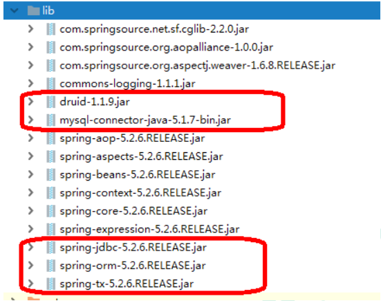

# JdbcTemplate

### 概念和准备

- 什么是 JdbcTemplate
    - Spring 框架对 JDBC 进行封装，使用 JdbcTemplate 方便实现对数据库操作
- 准备工作
    - 引入相关 jar 包
        
        
        
    - 在 spring 配置文件配置[数据库连接池](https://so.csdn.net/so/search?q=%E6%95%B0%E6%8D%AE%E5%BA%93%E8%BF%9E%E6%8E%A5%E6%B1%A0&spm=1001.2101.3001.7020)
        
        ```xml
        <bean id="dataSource" class="com.alibaba.druid.pool.DruidDataSource" destroy-method="close">
         <property name="url" value="jdbc:mysql:///test" />
         <property name="username" value="root" />
         <property name="password" value="root" />
         <property name="driverClassName" value="com.mysql.jdbc.Driver" />
        </bean>
        ```
        
    - 配置 JdbcTemplate 对象，注入 DataSource
        
        ```xml
        <!-- JdbcTemplate 对象 -->
        <bean id="jdbcTemplate" class="org.springframework.jdbc.core.JdbcTemplate">
         <!--注入 dataSource-->
         <property name="dataSource" ref="dataSource"></property><!--set方式注入-->
        </bean>
        ```
        
    - 创建 service 类，创建 dao 类，在 dao 注入 jdbcTemplate 对象
        - 配置文件
            
            ```xml
            <!-- 组件扫描 -->
            <context:component-scan base-package="com.atguigu"></context:component-scan>
            ```
            
        - Service类中注入Dao
            
            ```java
            @Service
            public class BookService {
             //注入 dao
             @Autowired
             private BookDao bookDao;
            }
            ```
            
        - dao 注入 jdbcTemplate 对象
            
            ```java
            @Repository
            public class BookDaoImpl implements BookDao {
             //注入 JdbcTemplate
             @Autowired
             private JdbcTemplate jdbcTemplate;
            }
            ```
            

### JdbcTemplate 操作数据库（添加）

- 对应数据库创建实体类
    
    ```java
    public class User {
    	private String userId;
    	private String username;
    	private String userstatus;
    	//生成对应的get、set方法
    }
    ```
    
- 编写 service 和 dao
    - 在 dao 进行数据库添加操作
    - 调用 JdbcTemplate 对象里面 update 方法实现添加操作
        
        <aside>
        📢 `update(String sql,Object... args)`
        
        第一个参数： sql 语句
        
        第二个参数：可变参数，设置 sql 语句值
        
        返回值为更新的行数
        
        </aside>
        
        ```java
        @Repository
        public class BookDaoImpl implements BookDao {
         //注入 JdbcTemplate
         @Autowired
         private JdbcTemplate jdbcTemplate;
         //添加的方法
         @Override
         public void add(Book book) {
         //1 创建 sql 语句
         String sql = "insert into t_book values(?,?,?)";
         //2 调用方法实现
         Object[] args = {book.getUserId(), book.getUsername(),book.getUstatus()};
         int update = jdbcTemplate.update(sql,args);
         System.out.println(update);
         }
        }
        ```
        
    - 测试类
        
        ```java
        @Test
        public void testJdbcTemplate() {
        	ApplicationContext context = new ClassPathXmlApplicationContext("bean1.xml");
        	BookService bookService = context.getBean("bookService",BookService.class);
        	Book book = new Book();
        	book.setUserId("1");
        	book.setUsername("java");
        	book.setUstatus("a");
        	bookService.addBook(book);
        }
        ```
        

### JdbcTemplate 操作数据库（修改和删除）

- 修改
    
    ```java
    @Override
    public void updateBook(Book book) {
     String sql = "update t_book set username=?,ustatus=? where user_id=?";
     Object[] args = {book.getUsername(), book.getUstatus(),book.getUserId()};
     int update = jdbcTemplate.update(sql, args);
     System.out.println(update);
    }
    ```
    
- 删除
    
    ```java
    @Override
    public void delete(String id) {
     String sql = "delete from t_book where user_id=?";
     int update = jdbcTemplate.update(sql, id);
     System.out.println(update);
    }
    ```
    

<aside>
📢 使用JdbcTemplate 模板所实现的 “增删改” 都是调用了同一个 “update” 方法

</aside>

### JdbcTemplate 操作数据库（查询返回某个值）

- 查询表里面有多少条记录，返回是某个值
- 使用 JdbcTemplate 实现查询返回某个值
    - 方法：`queryForObject(String sql,Class<T> requiredType)`
        - 第一个参数： sql 语句
        - 第二个参数：返回类型 Class
    
    ```java
    //查询表记录数
    @Override
    public int selectCount() {
    	 String sql = "select count(*) from t_book";
    	 Integer count = jdbcTemplate.queryForObject(sql, Integer.class);
    	 return count;
    }
    ```
    

### JdbcTemplate 操作数据库（查询返回对象）

- 场景：查询图书详情
- JdbcTemplate 实现查询返回对象
    - 方法：`queryForObject(String sql,RowMapper<T> rowMapper,Object... args)`
        - 第一个参数： sql 语句
        - 第二个参数：RowMapper 是接口，针对返回不同类型数据，使用这个接口里面实现类完成数据封装
        - *第三个参数：sql 语句值*
    
    ```java
    //查询返回对象
    @Override
    public Book findBookInfo(String id) {
     String sql = "select * from t_book where user_id=?";
    //调用方法
     Book book = jdbcTemplate.queryForObject(sql, new BeanPropertyRowMapper<Book>(Book.class), id);
     return book;
    }
    ```
    

### JdbcTemplate 操作数据库（查询返回集合）

- 场景：查询图书列表分页
- 调用 JdbcTemplate 方法实现查询返回集合
    - 方法：`query(String sql,RowMapper<T> rowMapper,Object... args)`
    
    ```java
    //查询返回集合
    @Override
    public List<Book> findAllBook() {
     String sql = "select * from t_book";
     //调用方法
     List<Book> bookList = jdbcTemplate.query(sql, new BeanPropertyRowMapper<Book>(Book.class));
     return bookList;
    }
    ```
    

### JdbcTemplate 操作数据库（批量操作）

- 方法：`batchUpdate(String sql, List<Object[]> batchArgs)`
    - 第一个参数： sql 语句
    - 第二个参数： List 集合，添加多条记录数据
- 批量添加
    
    ```java
    @Override
    public void batchAddBook(List<Object[]> batchArgs) {
    	String sql = "insert into t_book values(?,?,?)";
    	int[] ints = jdbcTemplate.batchUpdate(sql, batchArgs);
    	System.out.println(Arrays.toString(ints));
    }
    //批量添加测试
    List<Object[]> batchArgs = new ArrayList<>();
    Object[] o1 = {"3","java","a"};
    Object[] o2 = {"4","c++","b"};
    Object[] o3 = {"5","MySQL","c"};
    batchArgs.add(o1);
    batchArgs.add(o2);
    batchArgs.add(o3);
    //调用批量添加
    bookService.batchAdd(batchArgs);
    ```
    

- 批量修改
    
    ```java
    @Override
    public void batchUpdateBook(List<Object[]> batchArgs) {
    	String sql = "update t_book set username=?,ustatus=? where user_id=?";
    	int[] ints = jdbcTemplate.batchUpdate(sql, batchArgs);
    	System.out.println(Arrays.toString(ints));
    }
    //批量修改
    List<Object[]> batchArgs = new ArrayList<>();
    Object[] o1 = {"java0909","a3","3"};
    Object[] o2 = {"c++1010","b4","4"};
    Object[] o3 = {"MySQL1111","c5","5"};
    batchArgs.add(o1);
    batchArgs.add(o2);
    batchArgs.add(o3);
    //调用方法实现批量修改
    bookService.batchUpdate(batchArgs);
    ```
    
- 批量删除
    
    ```java
    @Override
    public void batchDeleteBook(List<Object[]> batchArgs) {
    	String sql = "delete from t_book where user_id=?";
    	int[] ints = jdbcTemplate.batchUpdate(sql, batchArgs);
    	System.out.println(Arrays.toString(ints));
    }
    //批量删除
    List<Object[]> batchArgs = new ArrayList<>();
    Object[] o1 = {"3"};
    Object[] o2 = {"4"};
    batchArgs.add(o1);
    batchArgs.add(o2);
    //调用方法实现批量删除
    bookService.batchDelete(batchArgs);
    ```