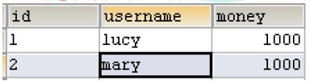

# 事务操作

### 事务概念

- 概念
    - 什么是事务
        - 事务是数据库操作最基本单元，逻辑上一组操作，要么都成功，如果有一个失败所有操作都失败
    - 典型场景：银行转账
        - lucy 转账100元 给mary,lucy少100，mary多100
        
- 事务四个特性（ACID）
    - 原子性
    - 一致性
    - 隔离性
    - 持久性

### 搭建事务操作环境

- 创建数据库表，添加记录
    
    
    
- 创建service，搭建dao，完成对象创建和注入关系
    - service注入dao，在dao注入JdbcTemplate，在JdbcTemplate注入DataSource
        
        ```java
        @Service
        public class UserService {
            //注入dao
            @Autowired
            private UserDao userDao;
        }
        ```
        
        ```java
        @Repository
        public class UserDaoImpl implements UserDao {
            @Autowired
            private JdbcTemplate jdbcTemplate;
        }
        ```
        
    - 在dao创建两个方法：多钱和少钱的方法，在service创建方法（转账的方法）
        
        ```java
        @Repository
        public class UserDaoImpl implements UserDao {
        
            @Autowired
            private JdbcTemplate jdbcTemplate;
        
            //lucy转账100给mary
            //少钱
            @Override
            public void reduceMoney() {
                String sql = "update t_account set money=money-? where username=?";
                jdbcTemplate.update(sql,100,"lucy");
            }
        
            //多钱
            @Override
            public void addMoney() {
                String sql = "update t_account set money=money+? where username=?";
                jdbcTemplate.update(sql,100,"mary");
            }
        }
        ```
        
        ```java
        @Service
        public class UserService {
            //注入dao
            @Autowired
            private UserDao userDao;
            //转账的方法
            public void accountMoney() {
                    //lucy少100
                    userDao.reduceMoney();
        
                    //mary多100
                    userDao.addMoney();
            }
        }
        ```
        
        <aside>
        📢 上面的代码，如果正常执行没有问题的，但是如果代码执行过程中出现异常则会出现问题
        
        </aside>
        
- 事务操作过程
    
    ```java
    public void accountMoney() {
            try {
                //第一步 开启事务
    
                //第二步 进行业务操作
                //lucy少100
                userDao.reduceMoney();
    
                //模拟异常
                int i = 10/0;
    
                //mary多100
                userDao.addMoney();
    
                //第三步 没有发生异常，提交事务
            }catch(Exception e) {
                //第四步 出现异常，事务回滚
            }
        }
    ```
    

### Spring 事务管理介绍

- 事务添加到JavaEE三层结构里面Service层（业务逻辑层）
- Spring事务管理操作：编程式事务管理 & 声明式事务管理
- 声明式事务管理
    - 基于注解方式
    - 基于xml配置文件方式

<aside>
📢 在Spring进行声明式事务管理，底层使用AOP原理

</aside>

- Spring事务管理API
    - 提供一个接口，代表事务管理器，这个接口针对不同的框架提供不同的实现类
    
    
    

### 注解声明式事务管理

- 在spring配置文件配置事务管理器
    
    ```xml
    <!--创建事务管理器-->
    <bean id="transactionManager" class="org.springframework.jdbc.datasource.DataSourceTransactionManager">
        <!--注入数据源-->
        <property name="dataSource" ref="dataSource"></property>
    </bean>
    
    ```
    
- 在spring配置文件，开启事务注解
    - 在spring配置文件引入名称空间 tx
        
        ```xml
        <!--创建事务管理器-->
            <bean id="transactionManager" class="org.springframework.jdbc.datasource.DataSourceTransactionManager">
                <!--注入数据源-->
                <property name="dataSource" ref="dataSource"></property>
        	  </bean>
        ```
        
    - 开启事务注解
        
        ```xml
        <beans xmlns="http://www.springframework.org/schema/beans"
               xmlns:xsi="http://www.w3.org/2001/XMLSchema-instance"
               xmlns:context="http://www.springframework.org/schema/context"
               xmlns:aop="http://www.springframework.org/schema/aop"
               xmlns:tx="http://www.springframework.org/schema/tx"
               xsi:schemaLocation="http://www.springframework.org/schema/beans http://www.springframework.org/schema/beans/spring-beans.xsd
                                http://www.springframework.org/schema/context http://www.springframework.org/schema/context/spring-context.xsd
                                http://www.springframework.org/schema/aop http://www.springframework.org/schema/aop/spring-aop.xsd
                                http://www.springframework.org/schema/tx http://www.springframework.org/schema/tx/spring-tx.xsd">
        ```
        
- 在service类上面（或者service类里面方法上面）添加事务注解
    - @Transactional，这个注解添加到类上面，也可以添加方法上面
        - 如果把这个注解添加类上面，这个类里面所有的方法都添加事务
        - 如果把这个注解添加方法上面，为这个方法添加事务
        
        ```java
        @Service 
        @Transactional 
        public class UserService {...}
        ```
        

### 声明式事务管理参数配置

- 在service类上面添加注解@Transactional，在这个注解里面可以配置事务相关参数
    - propagation：事务传播行为
        
        
        
    - ioslation：事务隔离级别
        - 三个读问题
            - 脏读：一个未提交事务读取到另一个未提交事务的数据
            - 不可重复读：一个未提交事务读取到另一提交事务修改数据
            - 虚读：一个未提交事务读取到另一提交事务添加数据
            
            
            
    - timeout：超时时间
        - 事务需要在一定时间内进行提交，如果不提交进行回滚
        - 默认值是 -1 ，即不允许超时
    - readOnly：是否只读
        - 默认值false，表示可以查询，可以添加修改删除操作
        - 设置成true，只能查询
    - rollbackFor：回滚
        - 设置出现哪些异常进行事务回滚
    - noRollbackFor：不回滚
        - 设置出现哪些异常不进行事务回滚

### XML 声明式事务管理

- 第一步 配置事务管理器
- 第二步 配置通知
- 第三步 配置切入点和切面
    
    ```xml
    <!--1 创建事务管理器-->
        <bean id="transactionManager" class="org.springframework.jdbc.datasource.DataSourceTransactionManager">
            <!--注入数据源-->
            <property name="dataSource" ref="dataSource"></property>
        </bean>
    
        <!--2 配置通知-->
        <tx:advice id="txadvice">
            <!--配置事务参数-->
            <tx:attributes>
                <!--指定哪种规则的方法上面添加事务-->
                <tx:method name="accountMoney" propagation="REQUIRED"/>
                <!--<tx:method name="account*"/>-->
            </tx:attributes>
        </tx:advice>
    
        <!--3 配置切入点和切面-->
        <aop:config>
            <!--配置切入点-->
            <aop:pointcut id="pt" expression="execution(* com.atguigu.spring5.service.UserService.*(..))"/>
            <!--配置切面-->
            <aop:advisor advice-ref="txadvice" pointcut-ref="pt"/>
        </aop:config>
    ```
    

### 完全注解声明式事务管理

- 创建配置类，使用配置类替代xml配置文件
    
    ```java
    @Configuration //配置类
    @ComponentScan(basePackages = "com.atguigu") //组件扫描
    @EnableTransactionManagement //开启事务
    public class TxConfig {
    
        //创建数据库连接池
        @Bean
        public DruidDataSource getDruidDataSource() {
            DruidDataSource dataSource = new DruidDataSource();
            dataSource.setDriverClassName("com.mysql.jdbc.Driver");
            dataSource.setUrl("jdbc:mysql:///user_db");
            dataSource.setUsername("root");
            dataSource.setPassword("root");
            return dataSource;
        }
    
        //创建JdbcTemplate对象
        @Bean
        public JdbcTemplate getJdbcTemplate(DataSource dataSource) {
            //到ioc容器中根据类型找到dataSource
            JdbcTemplate jdbcTemplate = new JdbcTemplate();
            //注入dataSource
            jdbcTemplate.setDataSource(dataSource);
            return jdbcTemplate;
        }
    
        //创建事务管理器
        @Bean
        public DataSourceTransactionManager getDataSourceTransactionManager(DataSource dataSource) {
            DataSourceTransactionManager transactionManager = new DataSourceTransactionManager();
            transactionManager.setDataSource(dataSource);
            return transactionManager;
        }
    }
    ```